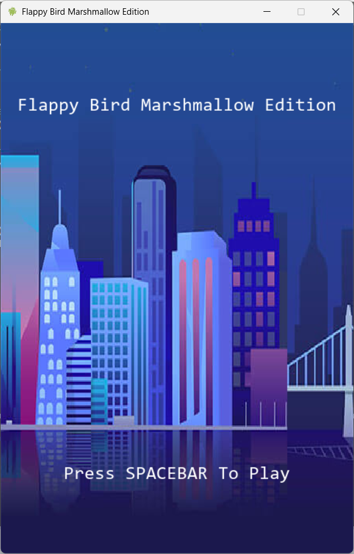
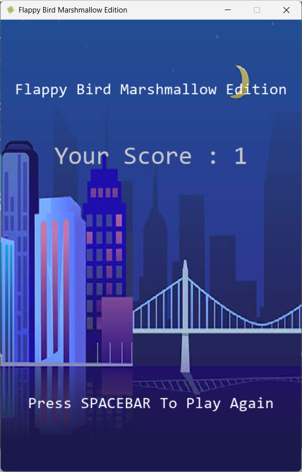
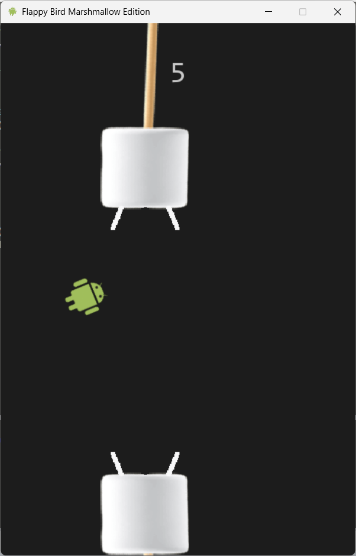

# Flappy Marshmallow 🐦🍬

A fun Flappy Bird–style game made with **Python** and **Pygame**, featuring marshmallows and an Android-inspired character instead of the usual pipes and bird!

---

## 🎮 Gameplay
Press **Space** to make your character jump.  
Avoid the marshmallows and try to get the highest score possible!

  
  
  

---

## 🧱 Features
- Simple and addictive mechanics  
- Fun Android-inspired theme  
- Custom graphics 
- Built with pure Python + Pygame  

---

## 🧰 Requirements
Make sure you have Python 3.8+ installed.

Then install dependencies:
pygame

```bash
pip install pygame
